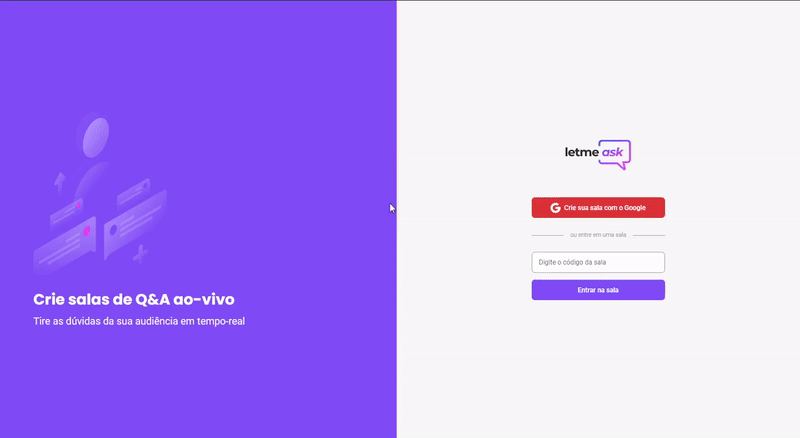
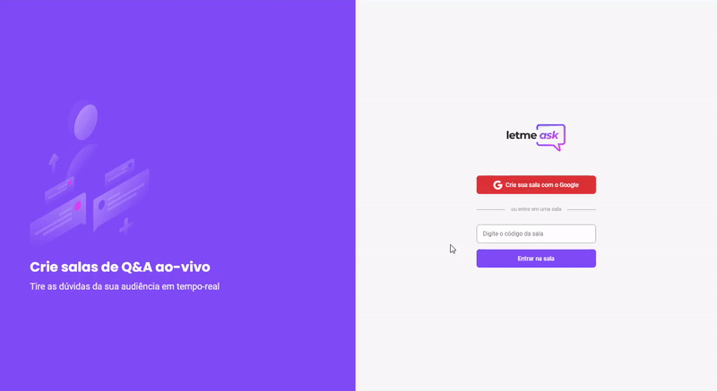

# Letmeask

Projeto criado na trilha de ReactJS durante a [Next Level Week Together](https://nextlevelweek.com/), feito pela Rocketseat. Letmeask é perfeito para criadores de conteúdo, pode-se criar salas de Q&A (perguntas e respostas) de forma rápida e organizada.
<br />

# Technologies

- [React](https://reactjs.org)
- [Firebase](https://firebase.google.com/)
- [TypeScript](https://www.typescriptlang.org/)
- [Sass](https://sass-lang.com/)

# Overview




## Dark mode


# How to run

```
# Clone this repository
$ git clone https://github.com/velleeda/letmeask

# Go to the directory
$ cd Letmeask
```

```
# Install Dependencies
$ yarn install

# Run Web Server
$ yarn start
```

O app estará disponível no seu browser pelo endereço http://localhost:3000.

Será necessário criar uma conta no [Firebase](https://firebase.google.com/) e um projeto para disponibilizar um Realtime Database.
